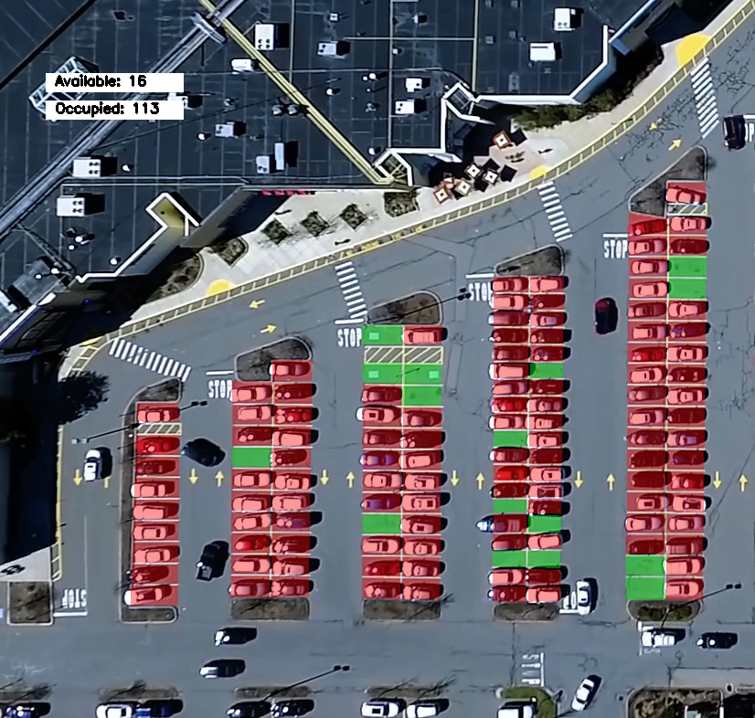
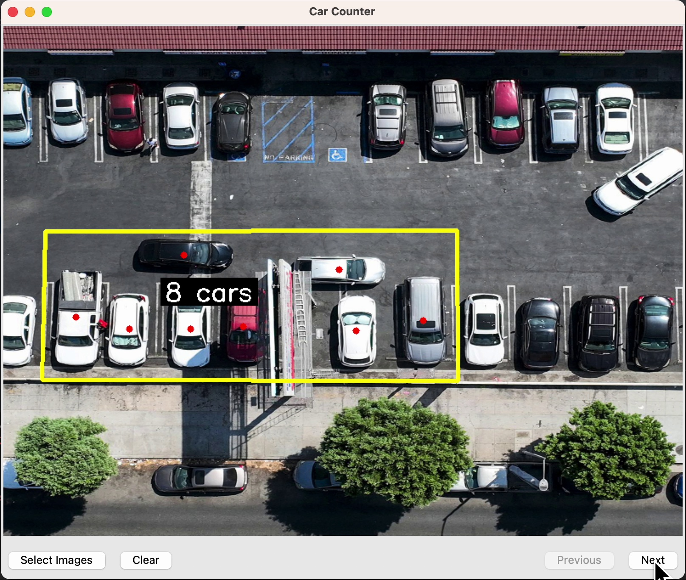
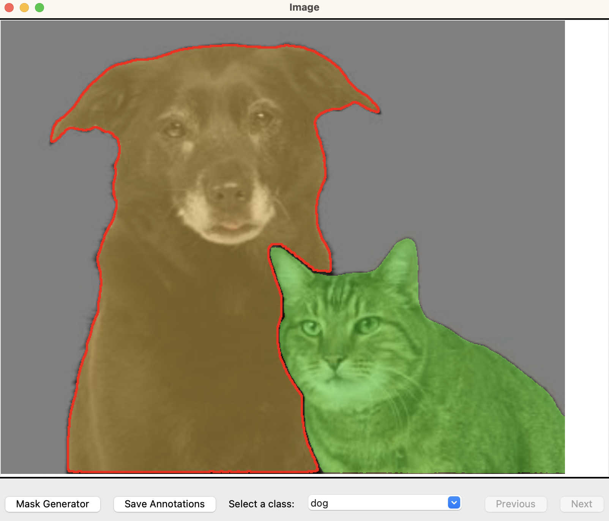

    
Tung Dinh

    
    
    
     

  
* I build machine learning and computer vision applications.
* Currently immersed in mastering object tracking, localization, and Kalman filter techniques.
* My interest lies in the intersection of AI, Robotics, and Design. 

⚡ Fun fact: Former architect, designing houses and structures.
  
### 🖥️ Projects
<table>

| Project                                                                                                                                                                                                                               | Technologies                                                                                                                                                                                                                                          |
|---------------------------------------------------------------------------------------------------------------------------------------------------------------------------------------------------------------------------------------|-------------------------------------------------------------------------------------------------------------------------------------------------------------------------------------------------------------------------------------------------------|
| [1. Parking Occupancy Analysis](https://github.com/tsdinh442/parking-space-counter)   |        |
| [2. Car Counter GUI](https://github.com/tsdinh442/car_counter_GUI)                         |        |
| [3. SAM-notator](https://github.com/tsdinh442/SAM-notator)                                     |            |

</table>

